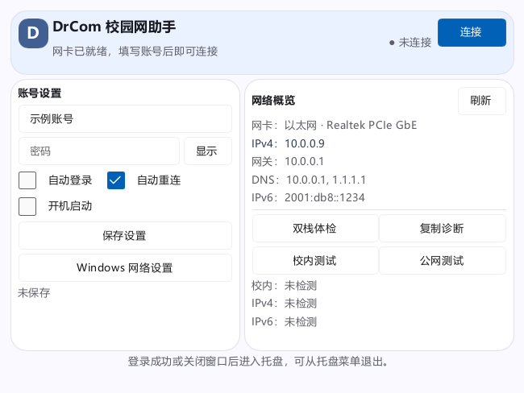

# DrCom 校园网助手（Rust 版）

[](https://www.rust-lang.org/)
[](https://slint.dev/)
[]()
[]()
[]()

吉林大学（JLU）校园网 Dr.COM 认证客户端的 **Rust + Slint** 重写版。完整实现
challenge → login → keep-alive → logout 协议流程，已对真实认证服务器长期实测通过；
同时提供图形界面与命令行两个入口。



> 同一协议还有一个 C# + Avalonia 实现，见主仓库
> [drcom-net-client](https://github.com/ZincGluxx/drcom-net-client)。

## ✨ 特性

**认证与保活**

- 完整 Dr.COM 认证流程，逐字节对应经过实战检验的 B 世代 Python 参考实现。
- 心跳保活自动协商，长时间在线不掉线（实测连续保活 7.5 小时无空档、零失败）。
- 支持多认证服务器地址依次尝试；可选登录前添加认证服务器 /32 主机路由。

**界面与系统集成**

- 单窗口紧凑布局：账号设置 + 网络概览 + 双栈体检，状态一目了然。
- 关闭窗口最小化到托盘，托盘菜单连接 / 下线 / 退出；单实例保护（重复启动会唤醒已运行实例）。
- 自动登录、自动重连、开机自启；凭据用 Windows DPAPI 加密保存，不落明文。

**诊断能力**

- 内网 / 校内 / 公网三层连通性测试 + IPv4/IPv6 双栈体检（针对国内网络环境选择可达目标）。
- 网络概览展示网卡、IP、网关、DNS 与全局 IPv6 地址。
- 全程事件日志（自动轮转），支持一键导出诊断报告，方便远程排障。

**命令行工具**

- `drcom-cli` 把同一套认证引擎带到无桌面环境（脚本、SSH、服务器），逐事件打印会话过程。

## 📊 与 C# 版的资源占用对比

同一台机器、同一协议、同一使用场景下的实测数据（详见
[测试报告](https://github.com/ZincGluxx/drcom-net-client/blob/master/docs/footprint-comparison-2026-09-17.md)）：

| 指标 | Rust + Slint | C# + Avalonia | 倍数 |
| --- | --- | --- | --- |
| 安装包 | **6.53 MB** | 11.57 MB | 1.77× |
| 应用本体 | **13.31 MB** | 32.77 MB | 2.46× |
| 工作集内存 | **23.8 MiB** | 47.9 MiB | 2.0× |
| 私有提交内存 | **5.4 MiB** | 19.8 MiB | 3.7× |
| 线程数 | **4** | 11 | 2.75× |
| 待机 CPU | ≈ 0 | ≈ 0 | 无差异 |

体积差几乎全部来自 Avalonia 捆绑的原生绘图栈（SkiaSharp / libGLESv2 / HarfBuzz
共约 18 MB）；Slint 自带纯 Rust 渲染器，没有这一层。

## 🚀 构建与打包

环境准备：[Rust](https://rustup.rs/)（MSVC 工具链）、Windows SDK（`rc.exe`，
用于编译图标资源；`build.rs` 会自动定位）、[Inno Setup 6](https://jrsoftware.org/isinfo.php)（仅打包需要）。

```bash
# 运行测试（基线：78 项库测试 + 15 项集成测试）
cargo test --offline

# 构建 GUI 与 CLI
cargo build --release --offline

# 静态检查
cargo clippy --offline --all-targets -- -D warnings
cargo fmt --check

# 制作安装包（产出 DrComRust_v<版本>_Setup.exe）
"C:/Program Files (x86)/Inno Setup 6/ISCC.exe" setup.iss
```

版本号在三处同步：`Cargo.toml`、`setup.iss` 的 `AppVersion` 与 `VersionInfoVersion`。

## 🖥 使用

### 图形界面 `drcom-campus.exe`

启动后填写账号密码即可连接。可选配置文件 `drcom.ini`（模板见
[drcom.ini.example](drcom.ini.example)），按以下顺序查找第一个存在的：

1. exe 所在目录
2. 当前工作目录
3. `%APPDATA%\DrComCampus\`

全部键均可省略：认证服务器有内置默认值，账号密码可留空由界面输入
（推荐留空，避免明文落盘）。

### 命令行 `drcom-cli.exe`

```text
drcom-cli --user 20230001 --pass secret
          [--server 10.100.61.3[,10.100.61.4]] [--local-ip 10.100.61.20]
          [--mac aa:bb:cc:dd:ee:ff] [--duration 秒] [--once] [--quiet]
```

- 密码可用环境变量 `DRCOM_PASSWORD` 传入，避免进入命令行历史；任何情况下不回显密码。
- `--once` 认证成功后立即下线；`--duration 0`（默认）持续保活，按 Enter 或输入 `q` 停止。
- `--auth-route` / `--auth-route-apply` 查看或应用认证服务器主机路由（后者需管理员）。

## 🔬 协议实现与测试

- 认证逻辑以社区 B 世代 Python 实现（`newclient.py` / `jlu-drcom-py3`）为基准，
  `src/reference_login.rs` 与之逐字节对应，是本部署实际认证成功的那一套。
- 登录帧长度随密码长度变化（368 / 370 / 373 / 374 字节），实现按 `password.len()`
  动态构造，参考向量固化在 `reference/` 下并由测试钉住。
- `reference/` 同时提供生成 / 校验向量的 Python 脚本，可独立复核协议实现。
- 测试覆盖：协议帧构造、配置解析（含错误行号提示）、偏好序列化、单实例、
  图标资源、UI 后端等 93 项。

## 📂 目录结构

```
drcom-rs/
├── src/            # 协议（auth/keepalive/transport）、会话、适配器、诊断、UI 后端
│   └── bin/        # drcom-cli 命令行入口
├── ui/             # Slint 界面描述（app.slint）
├── assets/         # 图标资源（exe 内嵌 + 托盘/窗口）
├── reference/      # 协议参考向量与 Python 校验脚本
├── examples/       # UI 预览示例
└── docs/           # 截图
```

## 🔗 相关仓库

- [drcom-net-client](https://github.com/ZincGluxx/drcom-net-client) — 主仓库：
  C# + Avalonia 实现与全部开发文档、诊断报告。
- [jlu-drcom-client](https://github.com/ZincGluxx/jlu-drcom-client) — 四个协议
  世代共八套社区实现的汇总参考。

## ⚠️ 声明

本项目为学习与个人使用目的对校园网认证协议的社区实现整理，仅限在
**你自己有合法账号的校园网内**使用；请遵守所在学校与运营商的网络使用规定。
